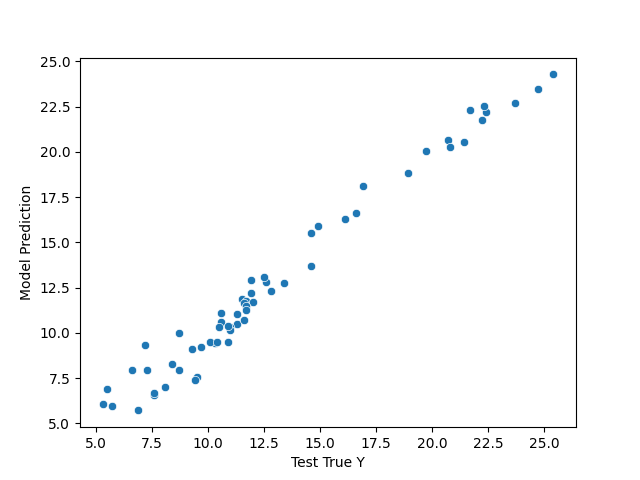

# Advertising Model 🤖

> Model that predicts how many sales has been made according to the number of advertisements in each channel.

[](https://github.com/jlenon7?tab=followers)
[](https://github.com/jlenon7/advertising-model/stargazers/)

<p>
    <a href="https://www.buymeacoffee.com/athenna" target="_blank"></a>
</p>

## Results

The model needs more training to be more precise:




## Running

To run the model first create a new Python environment and activate it. I'm using [Anaconda](https://www.anaconda.com/) for that:

```shell
conda create -n advertising_env python=3.11
conda activate advertising_env
```

Now install all the project dependencies:

```shell
make install-all
```

And run the model:

```shell
make model
```
